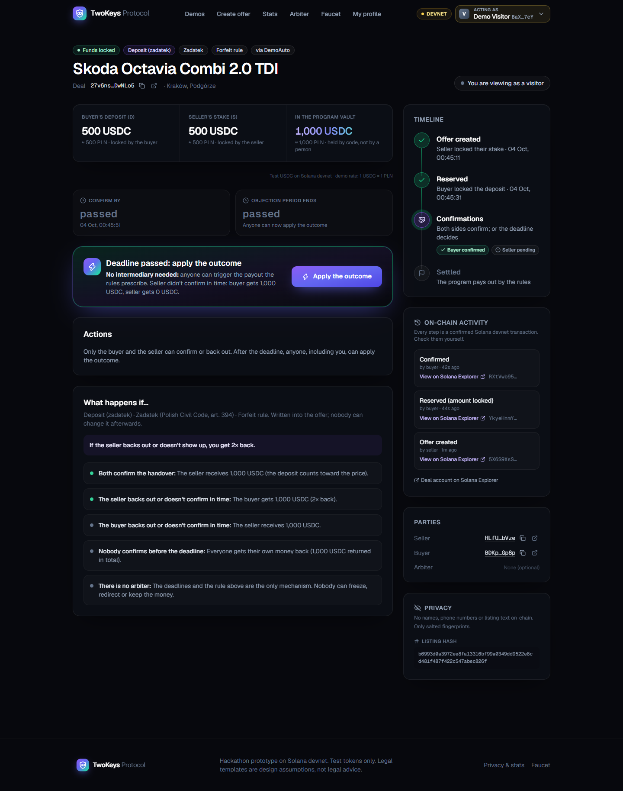
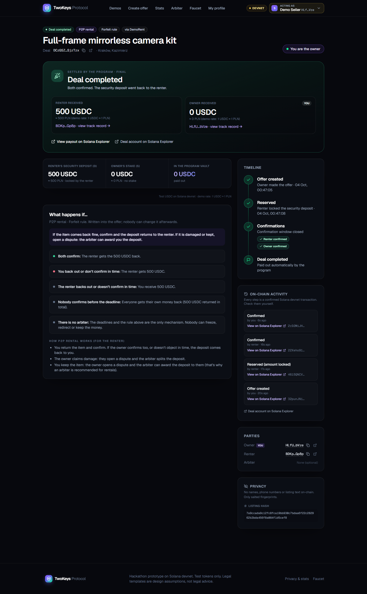

# TwoKeys — one trust component for every marketplace

> *"You can disappear — but not with my money."*

HackYeah 2026 · Superteam PL challenge **Finance Without Intermediaries** · Solana **devnet**

TwoKeys is a small Solana program plus an embeddable widget. When two strangers do a deal, the money goes
into a program-owned vault instead of to the other person, and the rules for who gets it back are fixed in
the program when the offer is created. Each sector is a **template**: the same program with different
parameters. The main use case is the Polish **zadatek** (reservation deposit, Civil Code art. 394) when
buying a car or a flat from an online listing.

| Template | Payer / payee | Penalty | When both confirm | Legal label |
|---|---|---|---|---|
| **Deposit** (main story) | buyer / seller | Forfeit | deposit → seller | Zadatek (S = D) |
| Rental | renter / owner | Forfeit | security deposit → back to renter | — |
| Freelance | client / freelancer | Forfeit | fee → freelancer | — |
| Purchase | buyer / seller | Forfeit | price → seller | — |

---

## Who it's for

- **Primary users:** people in Poland who find a car or flat on a listing site and are asked to pay a
  *zadatek* to someone they don't know, and the sellers who want serious buyers. They are **not crypto
  users**, so the UI talks about "accounts", shows amounts in PLN (demo rate 1 test USDC ≈ 1 PLN) and hides
  the technical layer.
- **Secondary users (distribution):** listing platforms that add the widget to their pages with one
  `<script>` tag.

## Design rationale

| Question | Answer |
|---|---|
| **Which financial relationship was redesigned?** | The deposit / advance payment you pay a stranger *before* the deal is completed (car, flat, rental deposit, freelance fee). |
| **Who was the intermediary?** | Usually **nobody**: the deposit goes by bank transfer (IBAN) straight to the other party, with no protection. When there is protection, it is expensive or slow: a **court** to enforce the zadatek rule (nobody sues over a few thousand złoty), a **notary escrow**, or the **platform's own payment protection** (fees, platform decides, can freeze or reverse). |
| **What changes when it is removed?** | The legal rule (whoever backs out loses; if the seller backs out, the buyer gets **2×**) is applied **instantly and without a court**. The money sits in a vault PDA that **no party and not us** can move outside the rules. No fees, and nobody can block or reverse the deal. If one side disappears, **anyone** can trigger the payout after the deadline. A scam seller also has to lock their own stake, which they lose if they vanish. |

## Where the intermediary disappears (code)

All money movement goes through **one function**. The frontend, database and widget cannot move funds or
change outcomes.

| What | Where |
|---|---|
| Payout table (pure function) | [`programs/twokeys/src/settle.rs`](programs/twokeys/src/settle.rs) → `payout()` (line 15), dispatched by `compute_payout()` on `deal.kind` |
| The only code that moves money out of the vault | `settle.rs` → `settle()` (line 122): computes the payout, asserts `to_payer + to_payee == P`, transfers with the deal PDA as signer, closes the vault, marks the deal `Settled` (terminal) |
| Both parties confirm → funds release | [`instructions/confirm_complete.rs`](programs/twokeys/src/instructions/confirm_complete.rs) |
| A party backs out → legal rule applies | [`instructions/withdraw.rs`](programs/twokeys/src/instructions/withdraw.rs) |
| **A party disappears → anyone applies the outcome** | [`instructions/claim_after_deadline.rs`](programs/twokeys/src/instructions/claim_after_deadline.rs): after `complete_deadline + grace_secs`, **any wallet** may call it; the silent party is treated as a no-show |
| Legal label constraints (zadatek ⇒ Forfeit + S = D + ToPayee) | [`instructions/create_offer.rs`](programs/twokeys/src/instructions/create_offer.rs) → `validate_legal_params()` |
| Where the money waits | Vault = SPL token account at PDA `["vault", deal]`, authority = the `Deal` PDA itself |

**"One of the parties disappears halfway. Where are the funds, who can recover them?"** The funds are in
the vault PDA. After the deadline, the remaining party (or anyone else) calls `claim_after_deadline`; the
program pays out by the rule (e.g. zadatek: the seller vanished → the buyer receives 2×). Nobody's
permission is needed.

## Permissions

There is **no admin, no fee and no admin instruction** in the program.

| Instruction | Who can call it | When |
|---|---|---|
| `create_offer` | payee (signs, locks stake S) | — |
| `cancel_offer` | payee anytime; **anyone** after the reserve deadline | `Offered` |
| `reserve` | any payer ≠ payee ≠ arbiter (locks D) | `Offered`, before reserve deadline |
| `confirm_complete` | payer or payee | `Reserved`, until deadline + grace |
| `withdraw` | payer or payee | `Reserved`, until deadline + grace |
| `claim_after_deadline` | **anyone** | `Reserved`, after deadline + grace |
| `open_dispute` | payer or payee, only if an arbiter was set in the offer | `Reserved`, until deadline + grace |
| `resolve(payer_bps, fault)` | only the arbiter named in the offer; can only split between the two parties | `Disputed`, until dispute deadline |
| `expire_dispute` | **anyone** (both get their own money back) | `Disputed`, after dispute deadline |

**Can the author change anything after deployment?** The program is upgradeable until the final deploy;
the plan is to revoke the upgrade authority with
`solana program set-upgrade-authority <PROGRAM_ID> --final` once everything works.
**Current status:** upgrade authority **still held** by `Hm5m1Zg6691tX66sBRVEmeQveHXs9U342xtiK63xmzUh`
(it will be revoked after the final deploy; this line will be updated).

The arbiter is **optional** and is written into the offer before the payer accepts it by reserving. The
main zadatek demo runs **without** an arbiter.

---

## What is where

```
twokeys/
├── programs/twokeys/src/      # Anchor program (all rules that move money)
│   ├── lib.rs                # 9 instructions
│   ├── state.rs              # Deal, Profile, PlatformStats, enums (Penalty, OnComplete, LegalLabel, Outcome…)
│   ├── settle.rs             # payout table + the single settle() routine (+ Rust unit tests)
│   ├── errors.rs / events.rs
│   └── instructions/         # one file per instruction
├── tests/                    # TypeScript scenario tests on LiteSVM (clock warping)
├── sdk/                      # @twokeys/sdk: PDA helpers, client, templates, payout preview
├── app/                      # Next.js app: DemoAuto, DemoRent, /d/[deal], /offer/new, stats, arbiter, faucet
├── widget/                   # embeddable widget.js (one <script> tag)
├── scripts/                  # devnet: test USDC mint, demo accounts, SDK end-to-end flows, faucet
├── deployments/devnet.json   # deployed addresses
├── pitch/                    # deck (PDF/PPTX), submission texts
├── docs/screens/             # screenshots
└── vendor/litesvm-win32/     # locally built LiteSVM binary for Windows only (see its README)
```

## Deployed on devnet

| What | Address |
|---|---|
| Program `twokeys` | [`AkQXPVXUYDqyNUVNAsYGYXy9sHQR636xcuJbAJkiJe5F`](https://explorer.solana.com/address/AkQXPVXUYDqyNUVNAsYGYXy9sHQR636xcuJbAJkiJe5F?cluster=devnet) |
| Test USDC mint (6 decimals) | [`7ajPpuq9PN9kcbNgLDkSDW2RCBhuXkeyKc758bbAZfb`](https://explorer.solana.com/address/7ajPpuq9PN9kcbNgLDkSDW2RCBhuXkeyKc758bbAZfb?cluster=devnet) |
| Platform id DemoAuto / DemoRent | `2CxboToKDAxRAcdN1t1WoPkBTBt7zSRd5q6BLT8PQfLQ` / `GTkDotc51vYisK1VwovWWtMaw4htRQ4Xjq3auT44AyAV` |
| Demo arbiter | `6su62ss4dnQFif8jUyWFJndFAuzNwc22cJB29suJcgMH` |

Example deals created by `scripts/demo-happy-path.ts`:
- Completed (both confirmed): [`Brih8gos…`](https://explorer.solana.com/address/Brih8goswkgjgoPaAQnKDd5u8AjuKL4KdsYTXiXFPcUC?cluster=devnet)
- Seller disappeared, a third party applied the outcome → buyer got 2×:
  [`E9xz9Dd6…`](https://explorer.solana.com/address/E9xz9Dd6ogNCaCbL5zoutqAbvbyF7JuGpJ6tj8Df9q19?cluster=devnet)
  ([claim tx](https://explorer.solana.com/tx/4W7ALLa7wSY9EMJBNXZ6qJBDmp39EYeyDrPNfjWVZCDwp12MFBBXK87CvepBweC2SpX1oWsqyBUiqMNHbhzDqec9?cluster=devnet))

## Screenshots

| DemoAuto listing + widget | Deadline passed: anyone applies the outcome | DemoRent: deposit returned |
|---|---|---|
|  |  |  |

All screenshots in `docs/screens/` were produced by the Playwright run (`app/e2e/flow.mjs`) against devnet.

---

## How it works

### State machine

```
Offered ──reserve──▶ Reserved ──(both confirm)──▶ Settled(Completed)
   │                   │
   │cancel / timeout   ├─withdraw─────────────▶ Settled(PayerWithdrew | PayeeWithdrew)
   ▼                   ├─claim_after_deadline─▶ Settled(PayerNoShow | PayeeNoShow | Expired)   ← anyone
Settled(Cancelled)     └─open_dispute──▶ Disputed ──resolve────────▶ Settled(Resolved)
                                            └──expire_dispute─▶ Settled(DisputeTimeout)      ← anyone
```

### Parameters and payouts (`D` = payer amount, `S` = payee stake, `P = D + S`)

- `penalty`: **Forfeit** (the party at fault loses what they locked) or **Refund** (everybody gets their money back).
- `on_complete`: **ToPayee** (deposit/fee/price goes to the payee) or **ToPayer** (rental deposit returns). `S` always returns to the payee.
- `legal_label`: `None | Zadatek | Zaliczka | TrBinding`, a label that constrains parameters (`Zadatek` ⇒ Forfeit, `S == D`, ToPayee; `Zaliczka` ⇒ Refund).

| Outcome | Forfeit: payer / payee | Refund: payer / payee |
|---|---|---|
| Completed | ToPayee: 0 / P · ToPayer: D / S | same |
| PayerWithdrew, PayerNoShow | 0 / P | D / S |
| PayeeWithdrew, PayeeNoShow | **P / 0** (zadatek: buyer gets 2×) | D / S |
| Expired (nobody confirmed), DisputeTimeout | D / S | D / S |
| Cancelled (no payer yet) | — / S | — / S |
| Resolved (arbiter) | `P·payer_bps/10000` / rest | same |

Confirmations work like this. The chain cannot see the physical world, so when **one** side confirms and
the other stays silent past the deadline, the confirming side wins. That is how "work delivered" or
"item returned" is decided without an intermediary.

### Accounts

| Account | Seeds | Purpose |
|---|---|---|
| `Deal` | `["deal", payee, offer_id_le]` | terms, parties, deadlines, status, outcome (kept after settlement as a receipt) |
| Vault | `["vault", deal]` | SPL token account owned by the deal PDA; closed at settlement |
| `Profile` | `["profile", wallet]` | behaviour trail: completed / withdrew / no-show / disputes lost / volume |
| `PlatformStats` | `["stats", platform]` | anonymous aggregate counters per integrating platform |

## Privacy (GDPR)

| On-chain (Solana) | Off-chain (deletable) |
|---|---|
| Locked funds (test USDC in the vault) | Names, e-mail, phone, identity |
| Wallet addresses, amounts, deadlines, rule parameters, status | Listing details, photos, documents |
| **Salted** SHA-256 hashes of the listing and dispute evidence | The salts (delete the salt → the hash points to nothing) |
| Behaviour counters (`Profile`), anonymous platform aggregates | Wallet ↔ person mapping |

Never on-chain: names, e-mails, phone numbers, addresses, plates, listing text, free text. Off-chain data
**cannot** move money or change an outcome. Identity escrow for large amounts is a *vision* item only
(not in the MVP), because it would be an off-chain trust mechanism.

---

## Quick start

### Versions used

| Tool | Version |
|---|---|
| Rust | 1.99.0 (stable) |
| Solana CLI (Agave) | 4.3.0 |
| Anchor CLI | 0.32.2 (crates `anchor-lang` / `anchor-spl` 0.32.1) |
| Node.js / pnpm | 24.x / 9.15.x |

### Build & test

```bash
pnpm install
anchor build                      # target/deploy/twokeys.so + IDL
node scripts/sync-idl.mjs         # copy IDL/types into the SDK
cargo test -p twokeys --lib        # payout table unit tests (Rust)
pnpm test                         # TypeScript scenario tests in LiteSVM (time travel)
```

### Run the app against devnet

```bash
pnpm devnet:setup                 # test USDC mint, demo accounts, writes app/.env.local
pnpm --filter @twokeys/app build && pnpm --filter @twokeys/app start   # http://localhost:3000
```

1. Use the built-in **demo accounts** (header switcher), or Phantom / Solflare set to **Devnet**.
2. `/dev/faucet` → fund the demo accounts (test USDC + a little SOL).
3. `/demo/auto` → pick a car → **Pay deposit safely with TwoKeys** (as the seller) → share `/d/<deal>` →
   switch to the buyer → **Reserve** → both confirm. Every step shows a **View on Solana Explorer** link.
4. "Seller disappears": reserve + confirm as the buyer only, wait for the deadline, then press
   **apply the outcome** as anyone.

### SDK flows from scripts

```bash
pnpm devnet:happy                    # create → reserve → confirm ×2 → Completed
pnpm devnet:happy -- --withdraw      # seller backs out → buyer gets 2×
pnpm devnet:happy -- --disappear     # seller vanishes → a third party claims → buyer gets 2×
pnpm --filter @twokeys/app e2e        # Playwright through the UI (app must be running)
```

### Deploy

```bash
anchor build
solana program deploy target/deploy/twokeys.so --program-id target/deploy/twokeys-keypair.json -u devnet
```

### Verified status

- `anchor build` ✔ · `cargo test -p twokeys --lib` → 15 passing ✔ · `pnpm test` → 31 passing ✔
- Program deployed/upgraded on devnet ✔ · SDK script flows (complete, withdraw, disappear) ✔ on devnet
- UI end-to-end on devnet (Playwright): DemoAuto completion ✔ · seller disappears → visitor applies the outcome → buyer 2× ✔ · DemoRent rental deposit returned ✔

---

## Limitations (honest)

- **Physical-world facts come from the parties.** The chain can't see whether a car was handed over or an
  item returned; it relies on confirmations plus deadlines. Silence after the deadline counts against the
  silent party.
- **Rental without an arbiter:** if a renter keeps the item and *nobody* confirms, the deal expires and
  both get their money back, so for rentals an arbiter is recommended. When an arbiter is chosen, they are
  trusted to split fairly, but they can only split between the two parties, never take funds, and silence
  refunds both.
- **Devnet only, test USDC, not audited.** No fee model, no real KYC.
- **Upgrade authority** is still held until the final deploy (see Permissions).
- **Deadlines use the cluster clock** (`Clock::unix_timestamp`), which can drift a few seconds.
- **Legal interpretation** of zadatek / zaliczka / the Turkish binding-deposit rule is a design assumption and needs
  legal review for a real product.
- Off-chain store is a local JSON file (not Supabase/Postgres) in the MVP.

## Decisions

Things the brief left open, resolved with the simplest safe option:

- **`create_offer` takes a `CreateOfferArgs` struct** with `kind: u8` (`0 = Standard`, otherwise
  `UnsupportedKind`; an enum argument would fail deserialization instead of returning the error).
- **Zadatek with `S ≠ D` returns `StakeMustEqualDeposit`**; every other label violation (zadatek with Refund
  or ToPayer, zaliczka with Forfeit) returns `InvalidLegalParams`.
- **`withdraw` is only allowed until `complete_deadline + grace_secs`.** After that, `claim_after_deadline`
  decides (no-show), so a late party cannot rewrite history.
- **`resolve` only until `dispute_deadline`**; afterwards anyone can `expire_dispute`.
- **Arbiter must differ from both parties** (`SelfDeal` on create / reserve).
- **Tokens donated to a vault** would block closing it; any surplus above `P` goes to the payee.
- **Profiles are created** in `create_offer` / `reserve`; token accounts in settling instructions are
  `init_if_needed` ATAs paid by the caller.
- **DisputeTimeout** changes no profile counter.
- **Identity escrow removed** (was a mock in an earlier iteration) to follow Superteam's rule that the logic
  replacing the intermediary must live on-chain.
- **Demo accounts**: in-browser burner keypairs (devnet/localhost only) so one presenter can play both
  sides; Phantom / Solflare work as usual. The faucet tops up a little SOL from the faucet key because
  public devnet airdrops are rate-limited.
- **Program size**: `opt-level = "s"` to reduce deploy rent. The program account was extended with
  `solana program extend` when the new version grew.
- **Windows toolchain** (no admin): `cargo build-sbf` host build scripts are linked with `lld-link`
  (rust-lld) against MSVC CRT/SDK libs fetched with `xwin`. LiteSVM has no official Windows binary, so
  `scripts/setup-litesvm-windows.mjs` installs a locally built one on Windows only.
- An earlier iteration of the project used buyer/seller naming, a `legal_rule` field and a DemoEstate
  site; it was generalised to payer/payee templates following the updated brief (see git history).

## Development timeline (disclosure)

- **Before the official start (3 Oct, morning):** project brief, first prototype of the program, tests, SDK and app (from about 05:20 on 3 Oct; the first devnet deploy of the program is visible on-chain). This repository was initialised with a single commit for submission.
- **During the event (3–4 Oct):** redesign to the Superteam rules (payer/payee templates, `penalty` / `on_complete` / `legal_label`), redeploy, DemoRent, Explorer activity log, "apply the outcome" flow, identity escrow removed, README, deck and video.

## Credits / External resources

- [Anchor](https://github.com/solana-foundation/anchor) (Apache-2.0): program framework, IDL, TS client.
- [Solana / Agave](https://github.com/anza-xyz/agave) toolchain, `@solana/web3.js`, `@solana/spl-token`, SPL Token & Associated Token programs.
- [LiteSVM](https://github.com/LiteSVM/litesvm): in-process SVM for tests.
- [Solana Wallet Adapter](https://github.com/anza-xyz/wallet-adapter): account connection in the app.
- [Next.js](https://nextjs.org), [React](https://react.dev), [Tailwind CSS](https://tailwindcss.com),
  [lucide-react](https://lucide.dev), [sonner](https://sonner.emilkowal.ski), `clsx`, `@noble/curves` (demo-account message signing), [Geist](https://vercel.com/font) font, `bs58`, `bn.js`.
- Mocha / Chai / tsx (tests), Playwright (UI end-to-end script).
- Solana Actions / Blinks spec (rendering via dial.to).
- [xwin](https://github.com/Jake-Shadle/xwin), [w64devkit](https://github.com/skeeto/w64devkit): Windows build tooling only.
- Superteam PL challenge materials and HackYeah FAQ (requirements).
- **AI assistance:** code, tests and texts were written with the help of an AI coding agent (Claude Code).
  The full development history is in the git log.
- All demo marketplaces ("DemoAuto", "DemoRent"), listings and images are fictional; no real brand names or logos.

## License

MIT
